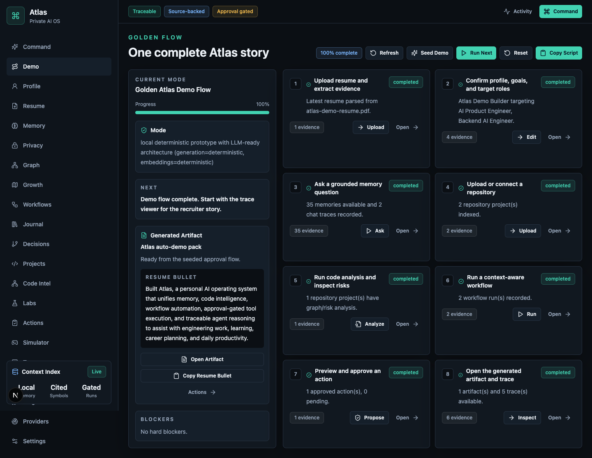
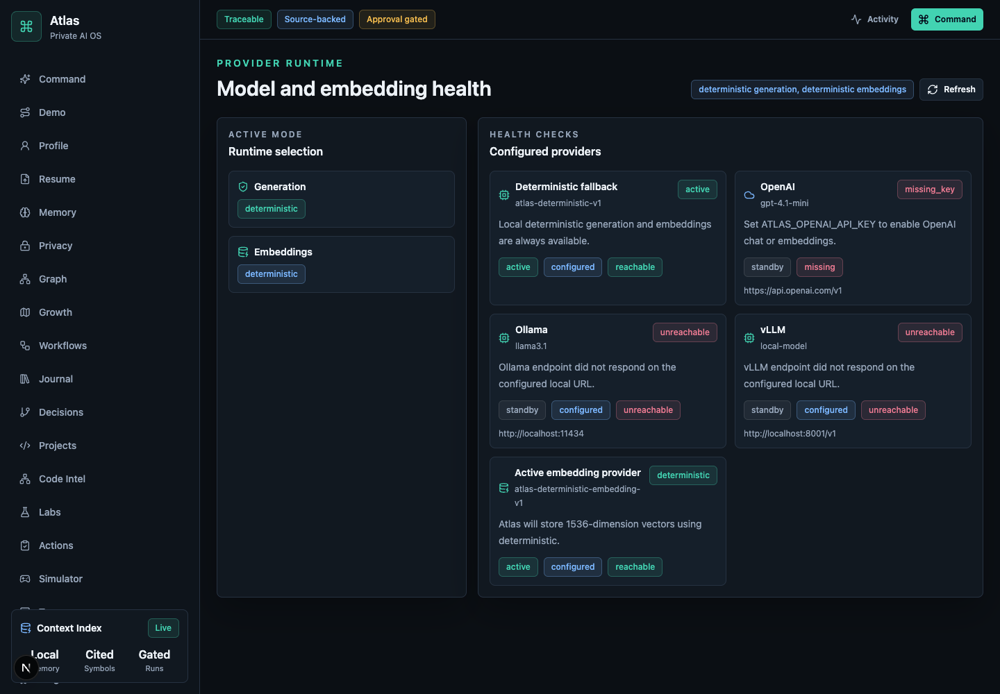
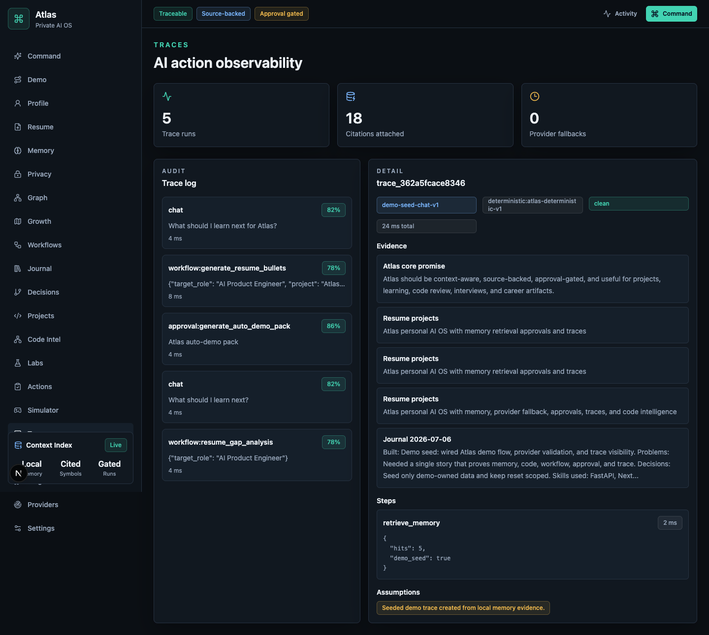
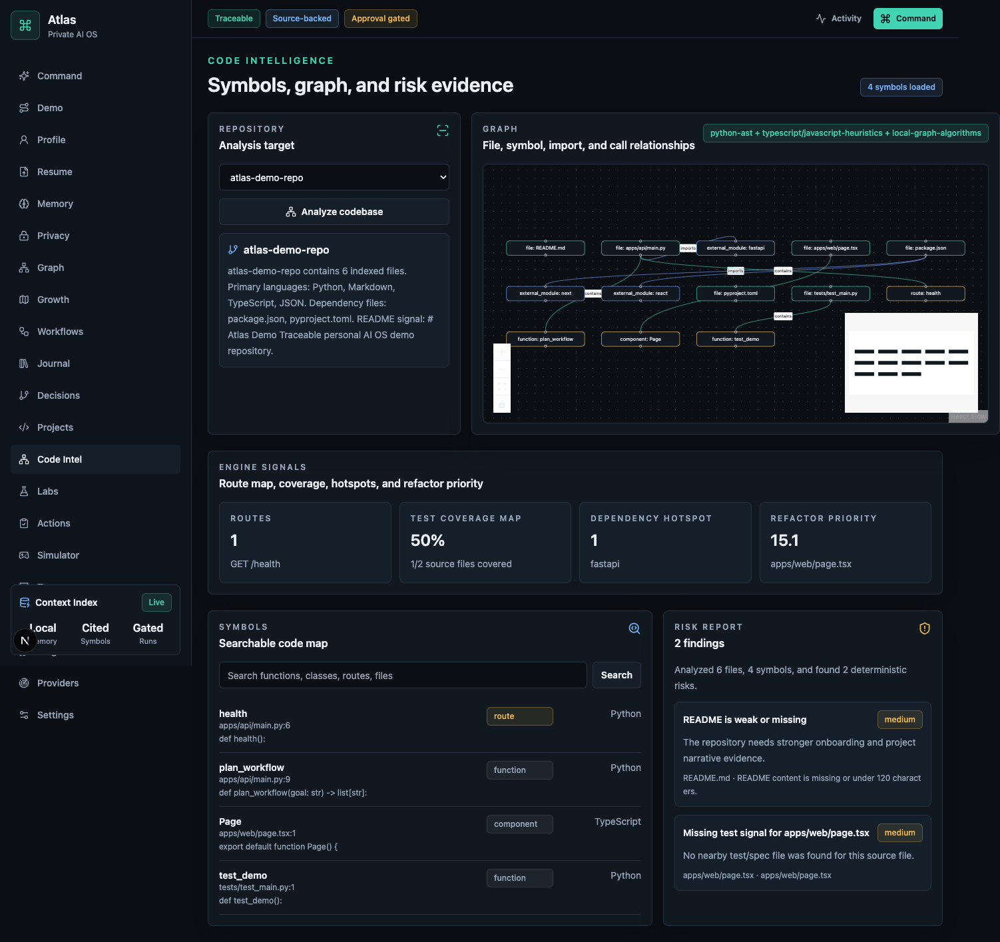
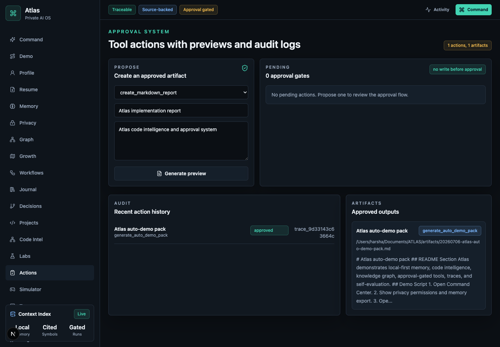
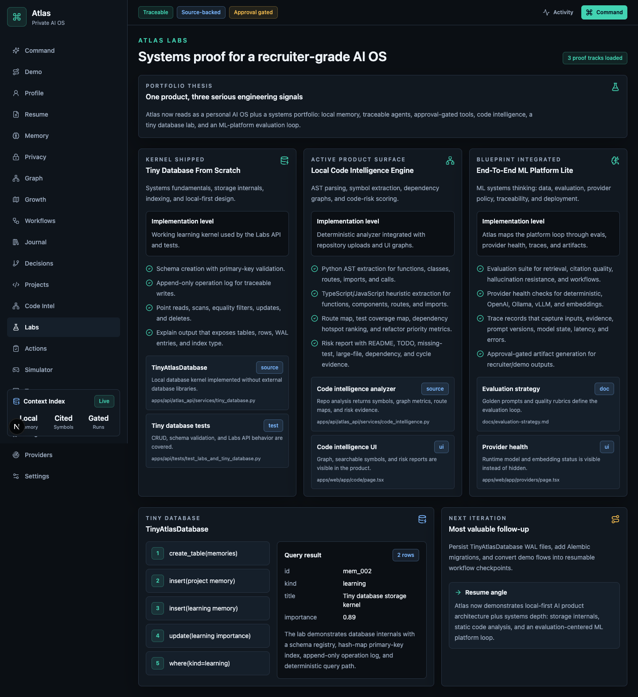

# Atlas

[](https://github.com/h-rsh-19/atlas-ai-os/actions/workflows/ci.yml)
[](#tech-stack)
[](#what-makes-atlas-different)

Atlas is a private, traceable personal AI operating system for engineering work, learning, career
planning, and daily productivity.

Current checkpoint: Atlas runs as a **local deterministic prototype with LLM-ready architecture**.
The product ambition is a personal AI OS, but the default runtime intentionally avoids cloud calls:
generation uses deterministic fallbacks, embeddings use a deterministic local provider, and real
OpenAI/Ollama/vLLM-style providers can be enabled through environment configuration.

## Problem

Students and developers usually scatter their context across resumes, notes, repos, project logs,
learning plans, and interview prep documents. Generic chatbots do not know that context, cannot cite
where claims came from, and often blur the line between suggestion and action.

## Solution

Atlas centralizes personal context and turns it into grounded workflows:

- Learn what to study next from profile, resume, memory, and journal evidence.
- Convert project logs into resume bullets and interview stories.
- Ingest repositories, extract symbols, build dependency graphs, and surface code risks.
- Run named workflows for planning, career intelligence, and codebase understanding.
- Propose artifacts and memory writes behind explicit approval gates.
- Inspect traces for every chat, workflow, evaluation, and approved action.

## Recruiter Walkthrough

Short path for reviewers:

1. Open [`docs/recruiter-walkthrough.md`](docs/recruiter-walkthrough.md) for the fastest portfolio read.
2. Visit the static recruiter demo page: <https://h-rsh-19.github.io/atlas-ai-os/>.
3. Watch [`docs/screenshots/atlas-demo-walkthrough.webm`](docs/screenshots/atlas-demo-walkthrough.webm) for the complete guided product loop.
4. Skim [`docs/architecture.md`](docs/architecture.md) for the system design, entity model, and service boundaries.
5. Check [`docs/evaluation-strategy.md`](docs/evaluation-strategy.md) and the CI badge above for validation discipline.

## Features

- Personal profile system for goals, roles, skills, weak areas, stack, and learning priorities.
- Resume PDF upload with raw text storage and structured section extraction.
- Source-backed memory CRUD with metadata, importance, tags, citations, embedding provenance, and
  reindexing support.
- Retrieval and context-aware chat with cited sources and trace IDs.
- Workflow engine for daily planning, weekly planning, journals, resume bullets, interview answers,
  learning plans, career analysis, and codebase workflows.
- Project journal system that generates weekly summaries, resume bullets, interview stories, and
  learning insights.
- Repository ingestion from GitHub URL metadata or local ZIP upload.
- Static code intelligence for functions, classes, routes, imports, exports, modules, and dependency
  files using Python AST plus TypeScript/JavaScript heuristics.
- React Flow graph visualization for file, symbol, import, contains, and call relationships.
- Deterministic code risk reports with evidence for large files, complex files, circular dependencies,
  missing tests, dependency hotspots, duplicated-looking modules, weak README/docs, and TODO/FIXME
  hotspots.
- Approval-gated action tools for Markdown reports, roadmaps, task lists, resume bullets, interview
  prep docs, GitHub issue drafts, and explicit memory writes.
- Local-first privacy controls for allowed folders, blocked folders, memory export, redaction preview,
  and user-initiated forget actions.
- Personal knowledge graph connecting skills, projects, goals, notes, repos, decisions, concepts, and
  code symbols.
- Decision journal for technical decisions, alternatives, tradeoffs, reasons, tags, and later results.
- Timeline of You plus a serious skill tree/RPG-style growth map from actual work logs, repos, and
  workflow evidence.
- Simulator mode for system design, debugging incidents, production outages, and behavioral interview
  drills with rubric-based evaluation.
- Plugin registry for GitHub, calendar, file, resume, repo analyzer, and interview coach capabilities.
- Provider layer for deterministic fallback, OpenAI-compatible chat/embeddings, Ollama, and vLLM-style
  endpoints.
- Pydantic-validated model JSON with visible provider-fallback warnings in chat and traces.
- Runtime provider health page for active generation, active embeddings, configured OpenAI state, and
  local Ollama/vLLM reachability.
- Personal command center with priorities, projects, pending approvals, recent memory, recent traces,
  weak areas, and next recommended action.
- Optional browser voice command mode with speech-to-text input and text-to-speech response.
- Local evaluation suite for resume bullet quality, retrieval accuracy, codebase Q&A correctness,
  workflow reliability, citation quality, and hallucination checks.
- Atlas Labs proof surface for three resume-grade systems tracks: a tiny database from scratch,
  the local code intelligence engine, and an end-to-end ML platform lite loop.

## Architecture

```text
apps/
  api/       FastAPI backend, local store, workflows, code intelligence, traces
  web/       Next.js dashboard, React Flow graph UI, approval/action surfaces
docs/        Product spec, architecture, eval strategy, demo script, sample data
docker/      API/web Dockerfiles and PostgreSQL pgvector init
scripts/     Local development notes
```

Core layers:

- Frontend: Next.js, TypeScript, Tailwind, shadcn-style primitives, lucide icons, React Flow.
- Backend: Python, FastAPI, Pydantic settings/schemas, modular API routers.
- Database path: local SQLite implementation for fast checkpoints plus PostgreSQL/pgvector-ready
  models and Docker infrastructure.
- Retrieval: provider-backed embeddings with deterministic fallback plus hybrid keyword/vector scoring.
- Workflow engine: named workflows with trace linkage, provider-backed structured JSON output, and a
  deterministic fallback path designed to later swap in LangGraph or OpenAI Agents SDK.
- Code intelligence: AST/heuristic parser, graph builder, deterministic risk analyzer.
- Labs: deterministic proof modules for storage internals, code intelligence, and ML platform
  evaluation architecture.
- Privacy and trust: local permission scopes, redaction, export, forget controls, and local-only mode.
- Knowledge graph: deterministic graph builder over profile, memory, journals, repos, code, and
  decisions.
- Simulation and evaluation: rubric-based drills and per-output self-evaluation.
- Plugins/models: capability registry plus cloud/local model provider options for generation and
  embeddings.
- Observability: internal trace records for inputs, retrieved memories, tools, outputs, latency,
  assumptions, errors, and steps.
- Approvals: preview, approve/reject, action audit, artifact records, and trace logs.

See `docs/architecture.md` for diagrams and entity details.
See `docs/engineering-debt.md` for explicit follow-ups on store composition, migrations, and visual QA.
See `docs/100-iteration-sprint.md` for the latest 100-step improvement ledger.

## Tech Stack

- Frontend: Next.js, React, TypeScript, Tailwind CSS, lucide-react, React Flow.
- Backend: FastAPI, Pydantic, Python.
- Database: PostgreSQL + pgvector in Docker Compose; local SQLite-backed store for this checkpoint.
- Background-ready infrastructure: Redis in Docker Compose.
- AI provider: deterministic fallback by default; OpenAI-compatible, Ollama, and vLLM-style providers
  are available through configuration.
- Code intelligence: Python AST, TypeScript/JavaScript heuristics, optional tree-sitter/networkx
  detection for future expansion.

## Screenshots

The screenshots below are generated from the seeded local demo flow with:

```bash
npm run capture:demo
```













Demo video: [`docs/screenshots/atlas-demo-walkthrough.webm`](docs/screenshots/atlas-demo-walkthrough.webm)

Capture notes are in `docs/demo-video-script.md`.

## Quickstart

```bash
cp .env.example .env
npm install
```

In one terminal:

```bash
cd apps/api
python -m venv .venv
source .venv/bin/activate
pip install -e ".[dev]"
uvicorn atlas_api.main:app --reload --port 8000
```

In another terminal:

```bash
npm run dev:web
```

Local URLs:

- Web: http://localhost:3000
- API health: http://localhost:8000/healthz
- API docs: http://localhost:8000/docs

Docker infrastructure:

```bash
docker compose up --build
```

## Validation

GitHub Actions runs backend tests, Ruff, frontend lint, and the Next production build on push and
pull request.

```bash
cd apps/api
ruff check atlas_api tests
pytest
```

```bash
npm run lint
npm run build:web
npm run test:e2e
```

## Demo Flow

1. Open Demo and click `Seed Demo` for a complete local demo state.
2. Use `Copy Script` to copy the recruiter walkthrough.
3. Use `Run Next Step`, blockers, and guided buttons to move through the flow.
4. Upload a resume PDF and inspect structured education, experience, projects, skills, certifications,
   and achievements.
5. Open Profile and save goals, target roles, skills, weak areas, stack, and learning priorities.
6. Ask a grounded question such as "What should I learn next?"
7. Upload or seed a repository, then analyze symbols, graph relationships, and risk evidence.
8. Run `generate_resume_bullets` or `prepare_interview_answer` from Workflows.
9. Open Actions, propose or inspect an auto-demo pack, approve it, and inspect the artifact/audit log.
10. Open Traces and inspect evidence, prompt version, provider, assumptions, latency, and steps.
11. Open Labs to show the tiny database, local code intelligence, and ML platform lite proof tracks.
12. Open Privacy, Graph, Growth, Decisions, Simulator, Evals, Plugins, and Providers as supporting
    depth.

## What Makes Atlas Different

- Context-aware, not generic: personal memory, resume, journal, project, and codebase evidence shape
  responses.
- Traceable by design: every AI-like operation stores inputs, evidence, assumptions, output, latency,
  and steps.
- Approval-gated tools: writes happen only after preview and explicit approval.
- Codebase-aware: Atlas can inspect repositories through symbols, graphs, and deterministic risk
  checks.
- Trust-aware: Atlas has privacy scopes, redaction, export, forget controls, and self-evaluation.
- Growth-aware: Atlas turns work logs and decisions into a timeline, skill map, and interview drills.
- Product-shaped UI: dedicated surfaces for memory, workflows, code intelligence, actions, traces,
  and evaluations.
- Systems proof: Labs connects Atlas to storage internals, static analysis, and ML-platform
  evaluation so it reads like a serious engineering portfolio, not only an app UI.

## Future Roadmap

- Production model policies, budgets, retries, and per-workflow provider selection.
- LangGraph or OpenAI Agents SDK for resumable multi-step agent workflows.
- Full tree-sitter grammars for richer symbol extraction and call graphs.
- Remote GitHub API integration after approval gates.
- Authentication, encrypted local secrets, and connector permissions.
- Background worker ingestion using Redis and a job queue.
- Claim-level citation scoring and golden-set eval fixtures.
- Deeper plugin SDK with versioned manifests and isolated tool execution.

## Resume Bullet

Built Atlas, a local deterministic prototype of a personal AI operating system with LLM-ready
architecture, unifying memory, code intelligence, workflow automation, approval-gated tool execution,
and traceable reasoning to assist with engineering work, learning, career planning, and productivity.
