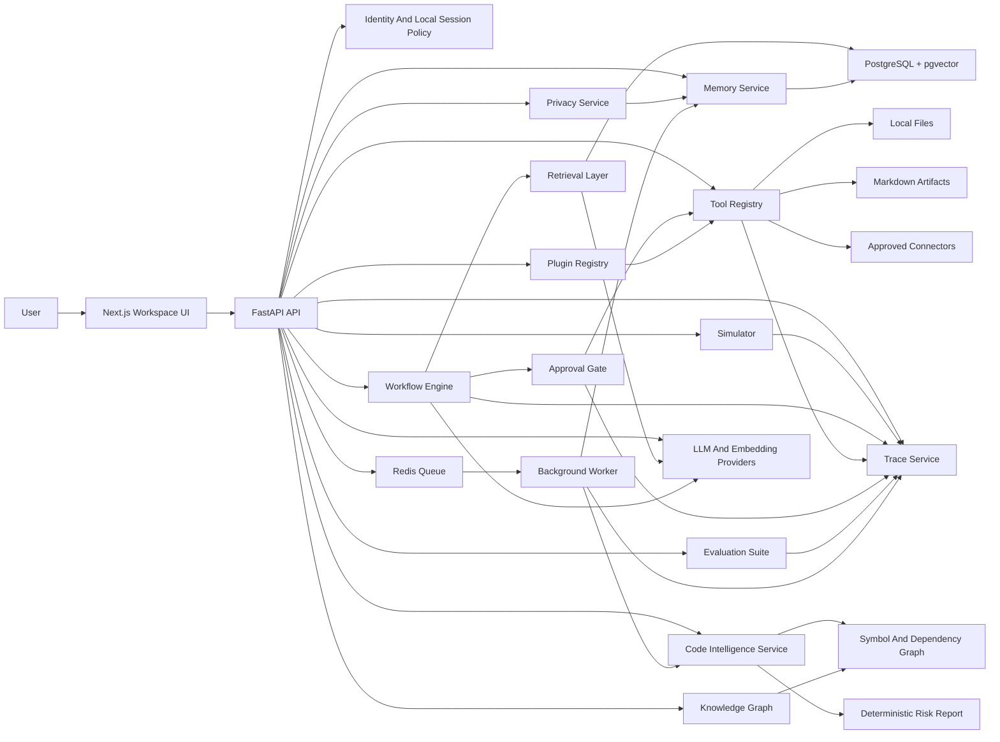
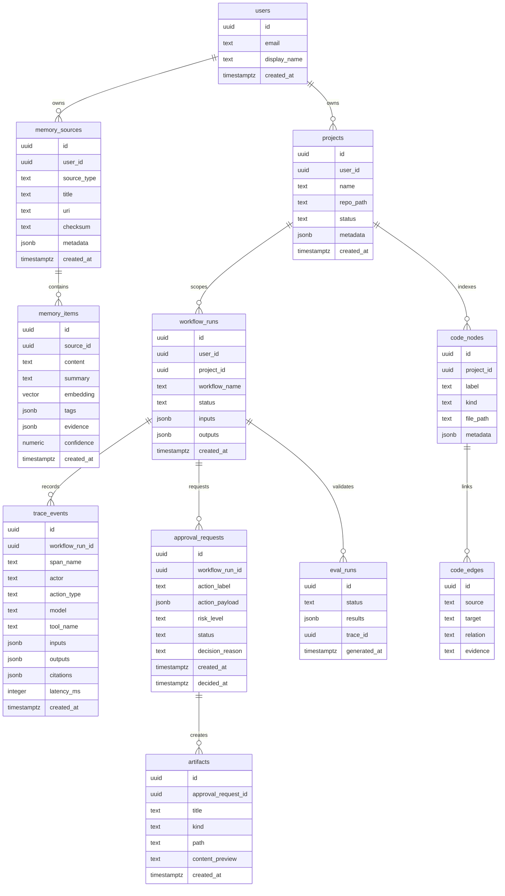

# Atlas Architecture

Atlas uses a production-style split between a typed web client, an API service, durable memory,
workflow orchestration, provider-backed AI boundaries, tool execution, approval gates, and internal
observability.

Current runtime mode: local deterministic prototype with LLM-ready architecture. Provider interfaces
exist for OpenAI-compatible cloud calls, Ollama, and vLLM-style endpoints, while deterministic
fallbacks keep local tests and demos offline by default.

## System Diagram

## Layers

### Frontend

- Next.js, TypeScript, Tailwind, shadcn-style primitives, lucide icons, and React Flow.
- Pages for command, profile, resume, memory, workflows, journal, projects, code intelligence,
  privacy, knowledge graph, growth, decisions, simulator, plugins, actions, traces, evaluations,
  and settings.
- No hidden autonomy: approvals and traces are first-class UI surfaces.
- React Flow renders stored graph nodes and edges for repository inspection.

### Backend

- FastAPI with modular routers under `/api`.
- `AtlasStore` is now a facade over focused service mixins: memory, workflow, trace, action, code,
  privacy, and growth.
- Pydantic settings and typed request/response schemas.
- SQLAlchemy models for memory, workflow state, trace events, and approvals.
- Health checks that separate process health from dependency health.

### Database

- PostgreSQL stores relational entities.
- pgvector stores embeddings for memory chunks, project summaries, and code intelligence nodes.
- JSONB stores structured evidence, tool payloads, trace inputs, and workflow outputs.

### Memory Layer

- Memory sources represent evidence: notes, files, resumes, code snippets, links, and user-authored facts.
- Memory items are chunked, summarized, embedded, tagged, and linked to sources.
- Embedding metadata records provider, model, and dimensions. A reindex endpoint supports intentional
  migration from deterministic vectors to real provider vectors.
- Durable memory must include provenance, confidence, and timestamps.

### Retrieval Layer

- Hybrid retrieval combines vector similarity, keyword filters, source type, recency, and project scope.
- Retrieval responses include citation payloads with source IDs, titles, URIs, and snippets.
- Retrieval quality metrics are stored as trace events.

### Workflow Engine

- MVP starts with explicit workflow records, deterministic fallback drafts, and provider-backed
  structured JSON output.
- Later versions can use LangGraph or OpenAI Agents SDK for resumable multi-step agents.
- Workflow runs contain inputs, outputs, status, model policy, and trace linkage.

### Tool Layer

- Tools are registered with name, capability, risk level, required approval policy, and input schema.
- Sensitive tools require approval before execution.
- Tool outputs are recorded as trace events and linked back to workflow runs.
- MVP tools produce Markdown reports, project roadmaps, task lists, resume bullets, interview prep
  docs, GitHub issue drafts, or explicit memories.

### Code Intelligence

- Repository ZIP ingestion stores text previews, language stats, dependency files, and README signal.
- Static analysis extracts Python functions/classes/routes via AST and TypeScript/JavaScript
  functions/classes/routes/imports via deterministic heuristics.
- The graph layer stores file, external module, and symbol nodes plus import, contains, and call edges.
- Risk analysis is deterministic and evidence-linked: large files, complex files, circular imports,
  missing tests, dependency hotspots, duplicated-looking modules, weak README/docs, and TODO/FIXME
  markers.
- Optional tree-sitter and networkx runtimes can be detected later without changing the API shape.

### Approval System

- Approval requests store the proposed action payload, risk level, status, requester, decision, and timestamps.
- The UI exposes pending actions before execution.
- Rejections are traceable and become part of the workflow history.
- Approved write actions create trace runs and artifact records.

### Privacy Layer

- Stores local permission scopes: allowed folders, blocked folders, local-only mode, and memory export
  policy.
- Provides redaction preview using user-editable regex patterns for emails, phone-like strings, API
  keys, tokens, and secrets.
- Supports user-initiated memory export and forget actions.

### Knowledge And Growth

- Builds a personal graph from profile skills/goals, memories, journal tags, repos, code symbols, and
  decision journal entries.
- Timeline of You derives project, workflow, journal, decision, and artifact events from durable
  Atlas state.
- Skill tree groups evidence into Backend, AI Agents, ML Systems, Databases, DevOps, System Design,
  DSA, Communication, and Engineering.

### Simulation

- Simulator scenarios cover system design, debugging incidents, production outages, and behavioral
  interviews.
- Answers are evaluated by rubric and traced for review.

### Plugin And Model Layer

- Plugin registry records capability, category, permission scopes, enabled state, status, and config.
- Cloud/local model providers are exposed for OpenAI-compatible cloud, Ollama, and vLLM endpoints.
- Provider status is visible in the UI; the default mode is deterministic unless configured otherwise.
- Provider JSON is validated with Pydantic output models before it can enter chat/workflow traces.
- If a provider fails or returns invalid JSON, Atlas records the error and clearly marks the
  deterministic fallback path in chat and trace UI.

### Golden Demo Flow

- `/api/demo/flow` computes live completion state for the recruiter demo:
  resume upload -> profile/goals -> memory retrieval -> repo upload -> code analysis -> workflow ->
  approval -> artifact -> trace.
- The web `/demo` page renders that state as a single guided path through the product.

### Evaluation Suite

- Local deterministic evals check whether Atlas has enough evidence for resume bullets, retrieval,
  codebase Q&A, workflow reliability, citation quality, and hallucination resistance.
- Eval runs store per-category status, score, evidence, summary, and trace ID.

### Observability

- Internal trace tables come first.
- Every AI action records actor, span name, action type, tool/model metadata, citations, latency, and payload hashes.
- Optional OpenTelemetry can be added later without replacing the internal audit model.

## Database Entity Overview

## Request Flow

1. The user submits a command in the web UI.
2. The API creates a workflow run and first trace event.
3. The workflow retrieves relevant memories and project context.
4. Atlas drafts a plan with citations and proposed actions.
5. Any sensitive action creates an approval request.
6. Approved tools execute and write trace events.
7. Final output is linked to memory citations, tool results, approvals, and trace IDs.
